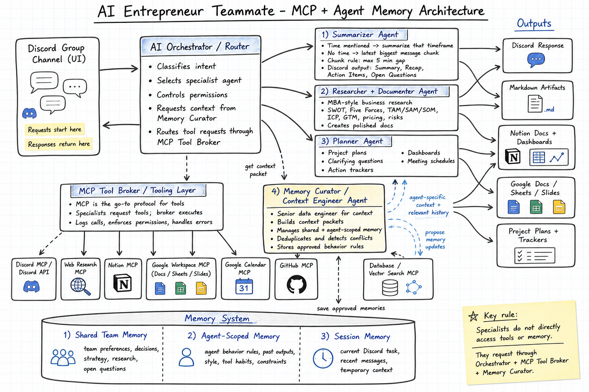
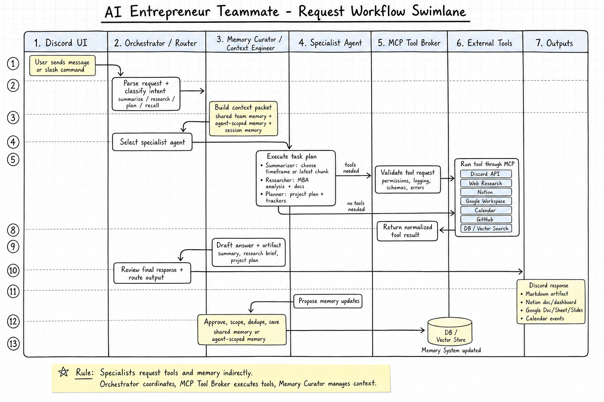

# AI Entrepreneur Teammate

AI Entrepreneur Teammate is a Discord-native AI teammate for a small founder group. It helps the team summarize conversations, research business ideas, create planning artifacts, and preserve durable context over time.

The goal is not just to build a chatbot. The goal is to build an AI teammate that can participate in a founder workflow, remember how the team operates, and produce useful business artifacts in Discord, Markdown, Notion, and Google Workspace.

## Product Docs

- [PRD](docs/product/ai-entrepreneur-teammate-prd.md)
- [MVP Backlog](docs/product/mvp-backlog.md)
- [Engineering Roadmap](docs/product/engineering-roadmap.md)
- [Technical Story Breakdown](docs/product/technical-story-breakdown.md)
- [GitHub Issues Seed](docs/product/github-issues-seed.md)

## High-Level Architecture



The system is organized around Discord as the primary UI, an AI orchestrator that routes requests, specialist agents that perform business tasks, MCP as the standard tooling protocol, and a memory system that stores both team-wide and agent-specific context.

## Workflow



At a high level:

1. A user sends a message or slash command in Discord.
2. The Orchestrator parses the request and classifies intent.
3. The Orchestrator asks the Memory Curator for relevant context.
4. The Memory Curator returns a context packet.
5. The Orchestrator selects the right specialist agent.
6. The specialist performs the task and requests tools when needed.
7. Tool requests go through the MCP Tool Broker.
8. External systems return normalized results through MCP.
9. The specialist drafts the response and artifact.
10. The Orchestrator routes the final response back to Discord and/or publishers.
11. The specialist proposes memory updates.
12. The Memory Curator scopes, deduplicates, and saves approved memory.

## Core Components

### Discord UI

Discord is the first interface for the team.

Responsibilities:

- receive slash commands and natural-language requests
- provide the current channel context
- return short, useful responses
- keep founder workflow inside the existing Discord group channel

MVP commands:

- `/summarize`
- `/research`
- `/remember`
- `/recall`
- `/tasks`

### AI Orchestrator / Router

The Orchestrator is the traffic controller for the system.

Responsibilities:

- parse incoming Discord messages
- classify the intent: summarize, research, plan, recall, or other
- select the correct specialist agent
- request context from the Memory Curator
- route tool requests through the MCP Tool Broker
- enforce permissions and safe execution boundaries
- assemble the final response path

The Orchestrator should not do every specialist task itself. It decides who should do the work and coordinates the flow.

### Summarizer Agent

The Summarizer Agent handles Discord conversation summaries.

Behavior:

- if a timeframe is mentioned, summarize messages from that timeframe
- if no timeframe is mentioned, summarize the latest message session in the current channel
- the approved MVP session rule uses a 6+ hour inactivity boundary
- output in Discord stays concise

Approved Discord summary format:

```md
Summary: date time

Recap

Action Items

Open Questions
```

Action item owners should be inferred only when clear. If uncertain, mark the owner as `Unassigned`.

### Researcher + Documenter Agent

The Researcher Agent behaves like a professional business researcher and MBA-style analyst.

Responsibilities:

- research products, companies, markets, competitors, and business ideas
- apply business frameworks such as SWOT, Porter's Five Forces, TAM/SAM/SOM, ICP, GTM, pricing, risks, and next experiments
- separate sourced facts from AI analysis
- create polished business documentation
- publish outputs to Markdown first, then Notion or Google Workspace

Expected research artifacts:

- executive summary
- customer and ICP analysis
- market sizing assumptions
- competitor landscape
- business model options
- go-to-market strategy
- pricing and unit economics assumptions
- risks and unknowns
- recommended next experiments
- source list

### Planner Agent

The Planner Agent converts ideas and research into execution plans.

Responsibilities:

- create project plans
- identify clarifying questions
- create action trackers
- define milestones, owners, dependencies, and risks
- create dashboards when useful
- help generate meeting schedules and follow-up plans

Planner output should be practical and operational, not just descriptive.

### Memory Curator / Context Engineer Agent

The Memory Curator is the system's context engineer. It behaves like a senior data engineer for memory and agent context.

Responsibilities:

- manage shared team memory
- manage agent-scoped memory
- manage session memory
- build context packets for the Orchestrator and specialist agents
- deduplicate memory entries
- detect conflicting memories
- decide what should be saved, updated, ignored, or marked for confirmation
- store approved behavior rules for specialist agents

Specialist agents should not directly rummage through memory. They request context, and the Memory Curator returns a clean context packet.

## Memory Design

The memory system has three layers.

### Shared Team Memory

Stores durable team context:

- founder preferences
- decisions
- business strategy
- product ideas
- ICP
- past research
- open questions
- recurring constraints

### Agent-Scoped Memory

Stores context for how each specialist should behave.

Examples:

- Summarizer Agent should use `Summary`, `Recap`, `Action Items`, and `Open Questions`.
- Researcher Agent should use MBA frameworks and cite sources.
- Planner Agent should produce owners, dependencies, risks, and timelines.
- Orchestrator should route tool calls through MCP.

### Session Memory

Stores temporary context for the current task:

- current Discord discussion
- recent messages
- current command
- in-progress research or planning task

## MCP Tooling Layer

MCP is the go-to protocol for accessing tools.

The tooling layer includes all external capabilities the AI system can use:

- Discord API
- Web research
- Notion
- Google Docs, Sheets, and Slides
- Google Calendar
- GitHub
- database and vector search
- artifact writer

The MCP Tool Broker sits between agents and tools.

Responsibilities:

- validate tool requests
- enforce permissions
- execute tools through MCP
- normalize tool results
- log tool calls
- handle recoverable errors

Specialist agents request tools indirectly. The Orchestrator and MCP Tool Broker control execution.

## MVP Direction

Build the narrowest useful teammate first:

1. Discord bot with slash commands.
2. Chat summarization for latest session and custom time windows.
3. Markdown artifact publishing.
4. Memory system for durable team and agent-scoped context.
5. MBA-style research brief generation.
6. Notion and Google Workspace publishing after the core workflow is reliable.

## Initial Implementation Principle

Keep the first version simple enough for two engineers to build and operate.

The MVP should prove:

- Discord request/response works.
- Orchestrator can route to a specialist.
- Summarizer can create useful summaries.
- Markdown artifacts can be saved.
- Memory can store explicit durable context.
- MCP can serve as the standard tool-access path.

After that, expand into richer research, planning, Notion dashboards, Google Workspace artifacts, and deeper agent-scoped memory.
