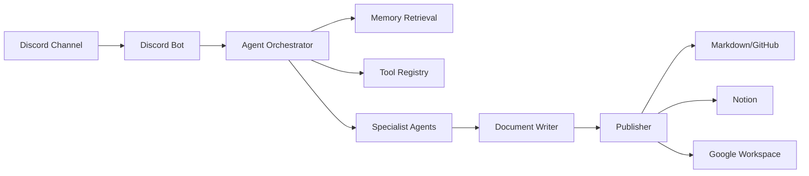

# Engineering Roadmap

## Recommended Stack

- Runtime: Python or TypeScript
- Bot framework: Discord.py for Python or discord.js for TypeScript
- API service: FastAPI or Hono/Express
- Jobs: built-in async workers for MVP, queue later
- Database: Postgres
- Vector search: pgvector for MVP
- LLM orchestration: lightweight internal orchestrator first
- Artifacts: Markdown files in repo
- Deployment: single container first

Suggested choice for two engineers: TypeScript with discord.js if the team prefers one language for bot and web tooling. Python with discord.py is better if research, data, and notebook-style workflows dominate.

## Proposed Repo Structure

```text
apps/
  discord-bot/
  worker/
packages/
  agents/
  memory/
  tools/
  schemas/
docs/
  product/
  architecture/
  artifacts/
tests/
```

## Technical Milestones

### Milestone 0: Project Setup

- Initialize GitHub repo.
- Choose TypeScript or Python.
- Add formatter, linter, test runner, and environment config.
- Add `docs/product` planning docs.
- Create GitHub issues from MVP backlog.

### Milestone 1: Discord Skeleton

- Register Discord app and bot.
- Implement slash command registration.
- Implement `/ping`, `/summarize`, `/research` placeholders.
- Add structured logging.

### Milestone 2: Message Ingestion And Summaries

- Fetch messages by time window.
- Implement last-session boundary.
- Build summary prompt and structured output schema.
- Persist summary artifact as Markdown.

### Milestone 3: Memory MVP

- Add database schema.
- Store explicit `/remember` entries.
- Add semantic retrieval.
- Add `/recall`.
- Inject relevant memory into summary and research workflows.

### Milestone 4: Research MVP

- Implement research task planner.
- Add web research tool.
- Generate structured research brief.
- Save Markdown artifact.
- Return artifact reference in Discord.

### Milestone 5: Multi-Agent Hardening

- Split summarizer, research, writer, memory curator, and publisher contracts.
- Add test fixtures.
- Add tool-call logging.
- Add evaluation examples for summaries and research briefs.

### Milestone 6: Workspace Publishing

- Add Notion publisher.
- Add Google Docs publisher.
- Add Google Sheets export for structured data.
- Add Google Slides outline generation.

## Two-Engineer Work Split

Engineer A: Discord and application backbone

- Discord bot setup
- Slash commands
- Message ingestion
- User/session permissions
- Deployment

Engineer B: Intelligence layer

- Agent contracts
- Summarization workflow
- Research workflow
- Memory store
- Artifact generation

Shared:

- Data schemas
- Tool registry
- Testing and eval fixtures
- Product prompt design

## Architecture Notes

The system should avoid hard-coding Discord, Notion, and Google directly into agent logic. Agents should request capabilities through a tool registry. This keeps the product extensible and prevents every new integration from becoming a rewrite.

High-level flow:



## First Implementation Decisions

- Use Markdown artifacts before Notion and Google publishing.
- Store summaries and research outputs in a consistent artifact format.
- Treat Notion and Google as publisher tools, not core agent dependencies.
- Keep the first memory model simple: Postgres rows plus embeddings.
- Use explicit user commands before scheduled automation.

## GitHub Project Setup

Recommended labels:

- `type:feature`
- `type:bug`
- `type:docs`
- `area:discord`
- `area:agents`
- `area:memory`
- `area:research`
- `area:publishing`
- `priority:p0`
- `priority:p1`
- `priority:p2`

Recommended milestones:

- `M0 Project Setup`
- `M1 Discord Skeleton`
- `M2 Summaries`
- `M3 Memory MVP`
- `M4 Research MVP`
- `M5 Agent Hardening`
- `M6 Workspace Publishing`
